# Gopala Krishna Abba

## Data & AI Systems Engineer

**Data Engineering · Applied ML · Search & Ranking · Backend Systems**

M.S. Computer Engineering, NYU Tandon — **May 2026 · 4.0 GPA**

**[View Portfolio](https://www.gopalakrishnaabba.com)** · [LinkedIn](https://www.linkedin.com/in/igopalakrishna/) · [Repositories](https://github.com/igopalakrishna?tab=repositories) · [Résumé](https://www.gopalakrishnaabba.com/resume/Gopala_Krishna_Abba_Resume.pdf) · [Email](mailto:hello.gopalakrishna@gmail.com)

## Recruiter Quick View

- Best aligned with early-career **Data Engineering, Applied Data Science, Search & Ranking, ML/Data Platform, and backend data systems** roles.
- Current research: **Graduate Research Assistant at NYU Chunara Lab** since January 2026, building reproducible news-data ingestion and structured LLM-labeling workflows.
- Most recent industry experience: **Data Science Intern — Emerging Technology at FOX Corporation / FOX Tech**, February–April 2026.
- Core differentiator: connecting data pipelines, retrieval and ranking, model evaluation, typed APIs, testing, and deployment into measurable end-to-end systems.

## Selected Impact

<table>
<tr>
<td align="center" width="50%"><strong>4.0 / 4.0</strong> NYU Tandon M.S. GPA</td>
<td align="center" width="50%"><strong>12,168 profiles</strong> hybrid retrieval at &lt;350 ms p95</td>
</tr>
<tr>
<td align="center" width="50%"><strong>~13M records</strong> historical MTA analysis</td>
<td align="center" width="50%"><strong>92.7% fewer bytes</strong> scanned in SignalLake benchmark</td>
</tr>
</table>

<picture>
  <source media="(max-width: 600px)" srcset="./assets/neural-systems-flow-mobile.svg">
  
</picture>

## Experience

**NYU Chunara Lab** — Graduate Research Assistant · *Jan 2026–present* 
Building reproducible pipelines across 10 U.S. newspapers that process 7,000+ articles weekly, plus validated LLM-labeling and external research datasets. [Experience details](https://www.gopalakrishnaabba.com/experience)

**FOX Corporation / FOX Tech** — Data Science Intern — Emerging Technology · *Feb–Apr 2026* 
Built a 9-stage Databricks pipeline and hybrid semantic clustering/ranking workflow for editorial content; validated duplicate-safe runs across 14 dates in 32–42 seconds. [Experience details](https://www.gopalakrishnaabba.com/experience)

**Global Futures Group** — Software Engineer Intern, AI/ML & Data Infrastructure · *Sep–Dec 2025* 
Built hybrid FAISS and BM25 retrieval, ranking, FastAPI, and PostgreSQL infrastructure for 12,168 expert profiles with p95 search latency below 350 ms. [Case study](https://www.gopalakrishnaabba.com/projects/retrieval-assistant)

**NYU DICE Lab** — Graduate Research Assistant · *May–Dec 2025* 
Implemented LoRA/PEFT experiments across DistilGPT-2 and Pythia models to measure Dynamic Tanh versus LayerNorm quality and inference trade-offs. [Research project](https://www.gopalakrishnaabba.com/projects/dyt-nonorm-llms-rewild)

## Featured Engineering Work

### [SignalLake](https://github.com/igopalakrishna/signallake) — Operational log analytics

Local-first ingestion and analytics platform that preserves raw JSONL events, transforms them into Hive-partitioned Parquet, and queries operational metrics directly with DuckDB.

`FastAPI` · `DuckDB` · `Parquet` · `Pydantic` · `Docker`

**Evidence:** benchmarked 1M events across 192 files; partition pruning reduced data scanned from 86.7 MB to 6.3 MB. Validated with 21 tests across four pytest files and GitHub Actions. [Case study](https://www.gopalakrishnaabba.com/projects/signal-ingestion-platform)

### [ExpertMatchAI](https://www.gopalakrishnaabba.com/projects/retrieval-assistant) — Hybrid expert search

Internship project combining FAISS vector retrieval, BM25 lexical search, structured geo filters, tunable ranking weights, and fallback logic behind FastAPI and PostgreSQL services.

`FAISS` · `BM25` · `FastAPI` · `PostgreSQL` · `Next.js`

**Evidence:** indexed 12,168 profiles; average response time below 200 ms, p95 below 350 ms, and full index rebuilds below 60 seconds. Validated with pytest, Vitest, and Playwright. Proprietary source code is not public.

### [NYC Subway Foot-Traffic Forecasting](https://github.com/igopalakrishna/nyc-subway-foot-traffic-prediction-and-forecasting) — Streaming ML

Combined analysis and model development over approximately 13M historical MTA records with a separate live self-hosted pipeline using simulated turnstile events.

`Kafka` · `Spark Structured Streaming` · `MongoDB` · `Random Forest` · `Docker`

**Evidence:** regression models reached approximately 2,700 RMSE and below 4.8% MAE; a separate traffic-level classifier reached 93.36% accuracy. [Case study](https://www.gopalakrishnaabba.com/projects/event-stream-router)

### [Colorectal Cancer Survival Prediction](https://github.com/igopalakrishna/colorectal-cancer-prediction) — Reproducible MLOps

Public-healthcare-data MLOps prototype covering feature selection, Gradient Boosting training, experiment tracking, Kubeflow orchestration, and Flask model serving; not a clinically validated system.

`scikit-learn` · `MLflow` · `DAGsHub` · `Kubeflow` · `Flask`

**Evidence:** processed 167,497 records, reduced 28 inputs to five through chi-square selection, and reached 92.9% accuracy with 0.89 ROC-AUC. [Case study](https://www.gopalakrishnaabba.com/projects/model-lifecycle-service)

<a href="https://github.com/igopalakrishna?tab=repositories">Explore public repositories →</a>

## Where My Experience Fits

| Role family | Strongest public evidence |
| --- | --- |
| **Data Engineering** | FOX Databricks pipeline, current NYU ingestion, SignalLake, Kafka/Spark streaming |
| **Applied Data Science / ML** | FOX clustering and ranking, NYU research, forecasting, reproducible MLOps |
| **Search & Ranking** | Global Futures / ExpertMatchAI hybrid retrieval, geo filtering, tunable ranking, fallbacks |
| **Backend Data Systems** | FastAPI, PostgreSQL, DuckDB, REST APIs, Docker, CI, structured logging, automated tests |

## Technical Toolkit

- **Data & Distributed Systems:** Python, SQL, PySpark, Spark Structured Streaming, Kafka, Databricks, Delta Lake, Parquet, DuckDB
- **ML, Retrieval & Evaluation:** scikit-learn, PyTorch, Hugging Face, FAISS, BM25, embeddings, MLflow, relevance and model evaluation
- **Backend & Databases:** FastAPI, Flask, PostgreSQL, MongoDB, Prisma, Next.js, TypeScript, REST APIs
- **Cloud, Testing & Delivery:** Docker, Kubernetes, Kubeflow, GitHub Actions, Vercel, Railway, pytest, Vitest, Playwright

## How I Work

> Start with the simplest correct system, define measurable behavior, and make failures visible before adding complexity.

- Evaluate retrieval and ML systems with explicit quality, latency, and failure criteria.
- Make data and model workflows reproducible through versioned artifacts, rerunnable pipelines, tests, and CI.
- Document architectural trade-offs so another engineer can understand both the result and its limits.

## Current Focus

I am currently building reproducible text-data and LLM-labeling systems at NYU Chunara Lab and am open to early-career roles in **Data Engineering, Applied Data Science, Search & Ranking, ML/Data Platforms, and backend systems for data and AI**.

**[View the portfolio](https://www.gopalakrishnaabba.com)** · [Explore repositories](https://github.com/igopalakrishna?tab=repositories) · [Connect on LinkedIn](https://www.linkedin.com/in/igopalakrishna/) · [Email me](mailto:hello.gopalakrishna@gmail.com)
